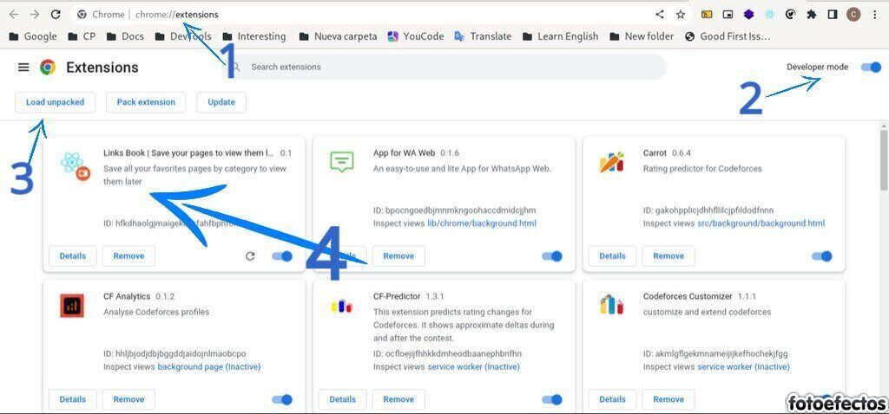

# Link.Book 
> A Chrome Extension to save the page links and view them later
> Carlos Manuel González Peña

## Run on development

* Install dependencies 

```bash
npm install
```

* Run application

```bash
npm start
```


## Test like Chrome Extension

First we create the production structure.

```bash
npm run build
```

Now, go to __chrome://extensions/__ in the browser and turn on `Developer Mode`.
Click the `Load Unpacked` button and select the `build` folder in the application folder.
After, the application will be displayed in the upper left corner of the browser along with your other extensions.




## Developer

Carlos Manuel González Peña [@cmglezpdev](https://twitter.com/cmglezpdev)